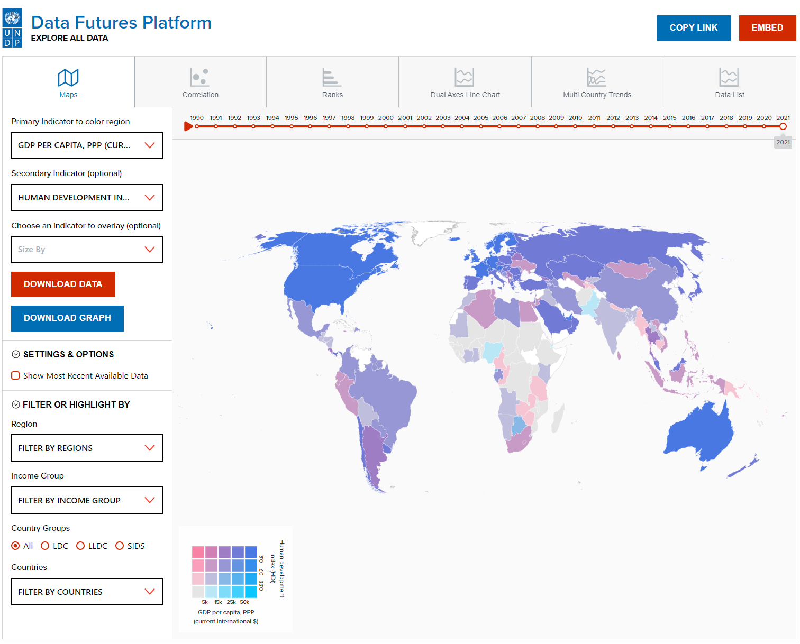
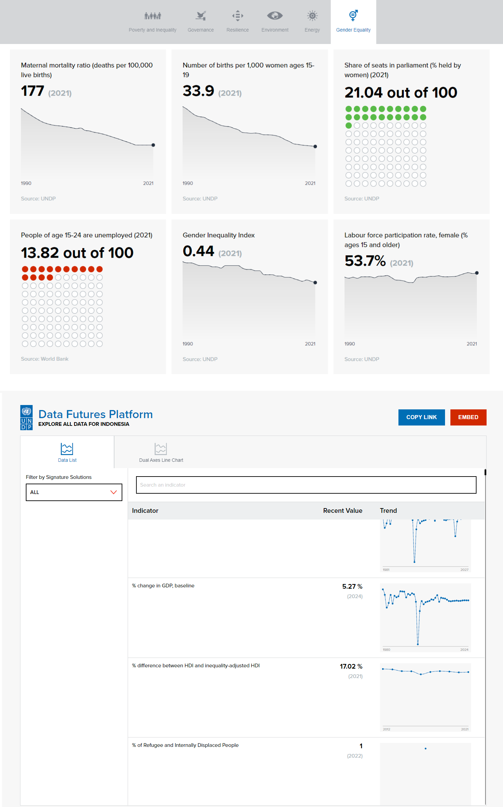
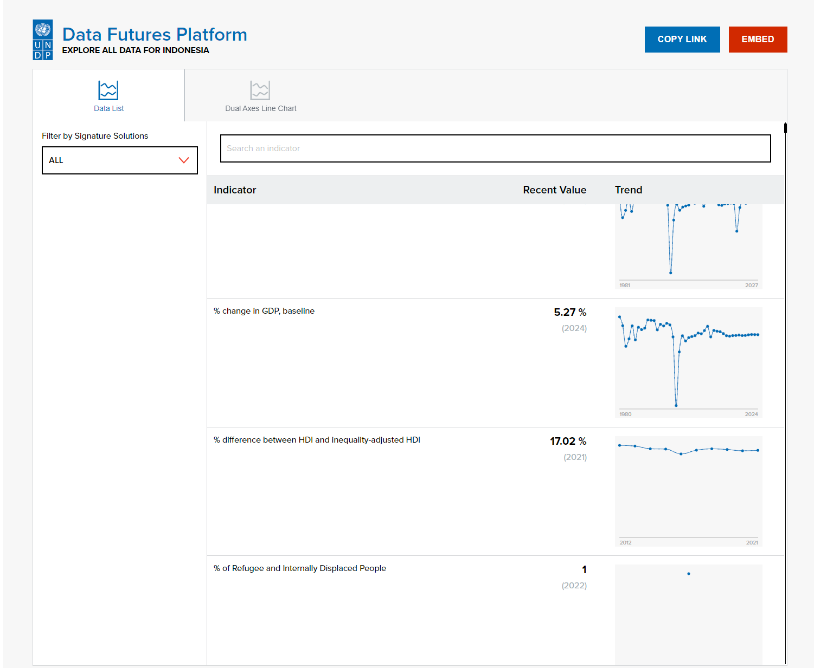
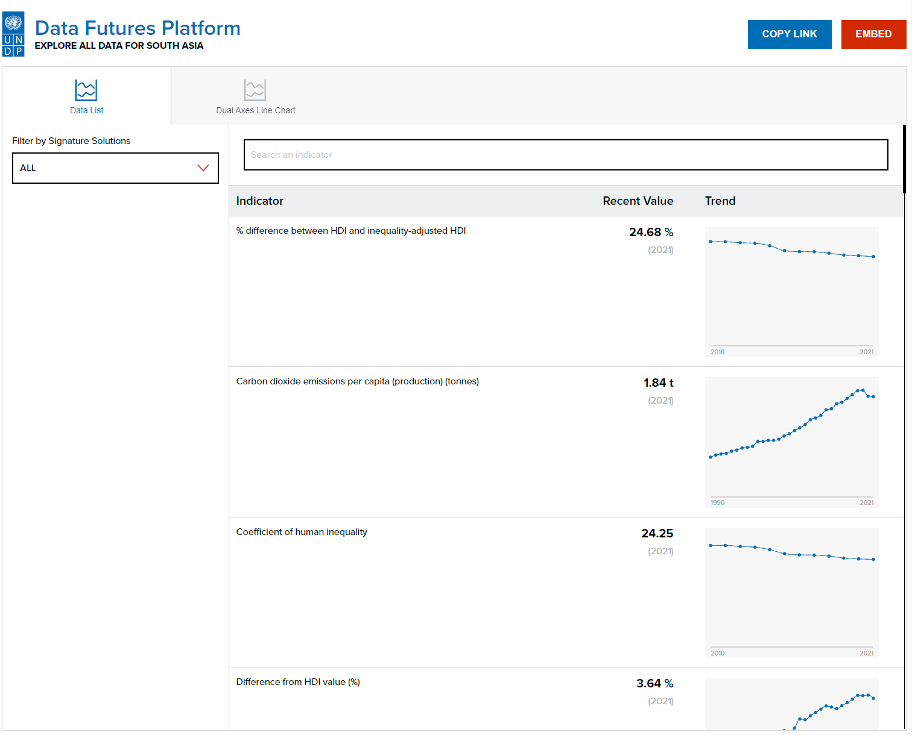
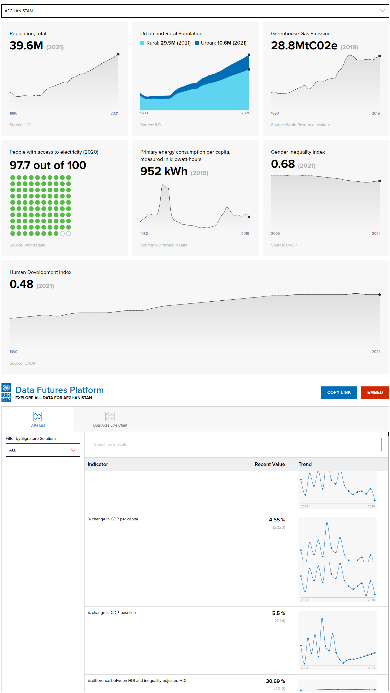
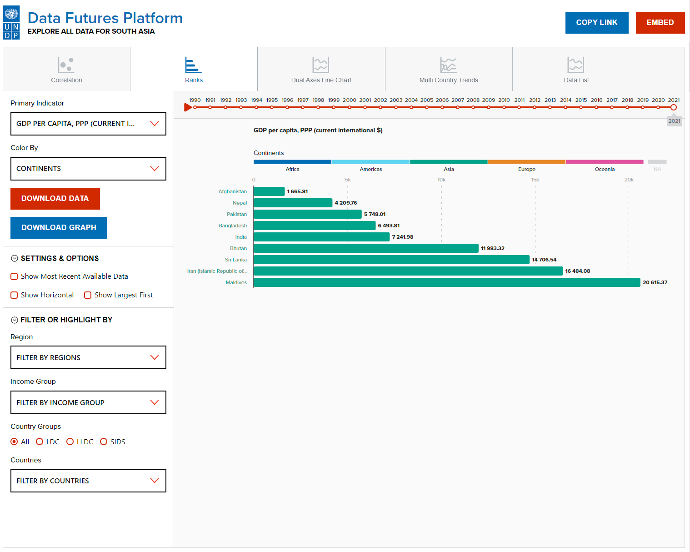
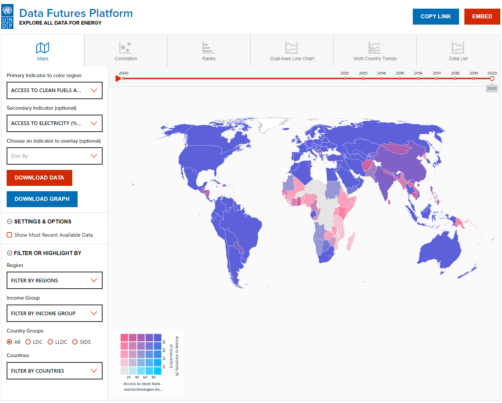
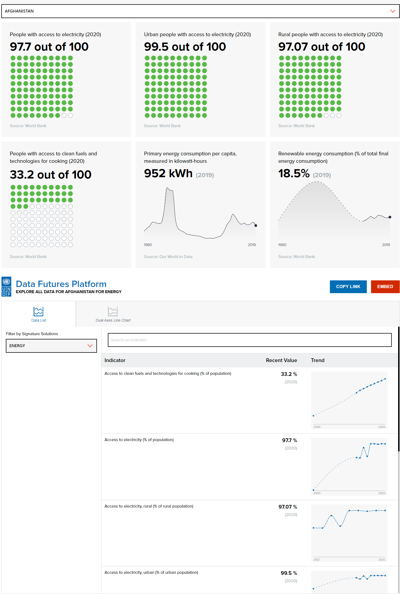

# Access All Data Visualization in UNDP's Data Futures Platform
#### This project aims to provide interactive visualizations for exploring and analyzing multi dimensional data. [Click here to see the interface](https://zealous-sky-017344110.2.azurestaticapps.net).

## Table of Contents
* [Link for the visualization](#section-01)
* [Deployment](#deployment)
* [Steps to integrate the vis in static page](#section-02)
    * [Steps to integrate Main Viz](#section-02-01)
    * [Steps to integrate Country Level Viz](#section-02-02)
    * [Steps to integrate Regional Level Viz](#section-02-03)
    * [Steps to integrate Signature Solution Level Viz](#section-02-04)
* [Pages on DFP where This Viz is Used](#section-03)
* [Related Repos](#section-04)
* [Global CSS Files and Repo](#section-05)
* [Build With](#section-06)
* [Installation](#section-07)
* [Local Deployment](#section-08)
* [Available Scripts](#section-09)
* [Tooling Setup](#section-10)
* [Contact](#section-11)

## Link for the visualization<a name="section-01"></a>
[https://zealous-sky-017344110.2.azurestaticapps.net](https://zealous-sky-017344110.2.azurestaticapps.net)

## Deployment<a name="deployment"></a>
The Production site deployed using Azure Static Web App and work flow can be found [here](https://github.com/UNDP-Data/Access-All-Data-Viz/blob/production/.github/workflows/azure-static-web-apps-zealous-sky-017344110.yml)

## Steps to Integrating the Visualization in the Data Future Platform or Any Other Page<a name="section-02"></a>
_Only editor and admins of Data Futures Platform are allowed to edit pages and embed the visualization in any page on data futures platform._

There are many type of visualization in this page:
* __Main visualization with all the data for all the country__
* __Country level visualization__
* __Regional level visualization__
* __Signature Solution level visualization__

### Main Visualization<a name="section-02-01"></a>

This is the parent visualization with all the data for all the countries. This visualization is used in teh __Access All Data__ page in DFP.



Main visualization `Explore All Data` will be rendered within the following div on a static page:
```
<div data-bucket-embed></div>
```
___

### Country Level Visualization<a name="section-02-02"></a>

This is the visualization which are embedded in the country pages. There two subcategories here:

#### With the summary visualization on the top categorized by signature solutions



This visualization will be rendered within the following div on a static page:

```
<div class="country~<Use Country Alpha-3 Code Here>" data-bucket-country-embed></div>
```
___

#### Without the summary visualization on the top



This visualization will be rendered within the following div on a static page:
```
<div class="country~<Use Country Alpha-3 Code Here>" data-bucket-country-without-summary-embed></div>
```

_The difference between country visualization and main visualization are as follow:_
* Country viz only uses the selected country data
* Country viz don't have maps, scatter plot, bar charts and multi-line chart
___

### Regional Level Visualization<a name="section-02-03"></a>

This is the visualization which are embedded in the regional pages. There four subcategories here:

#### Main regional level visualization



This visualization will be rendered within the following div on a static page:
```
<div class="region~<Use Region Code Here>" data-bucket-region-embed></div>
```

_The difference between this visualization and main visualization are as follow:_
* Country viz only uses the aggregated region data
* Country viz don't have maps, scatter plot, bar charts and multi-line chart

_Please note the region AP is treated differently as its split in 2 sub-regions SA and EAP_

#### Country Profile with country selection within the region



This visualization will be rendered within the following div on a static page:
```
<div class="region~<Use Region Code Here>" data-bucket-region-country-embed></div>
```

_This visualization is very similar to the Country Level visualization with some key difference:_
* Users have the ability to select a country they want to focus
* Summary visualization on the top are not categorized by signature solutions, but some key data points are used for this

#### Regional visualization comparing countries within the region



This visualization will be rendered within the following div on a static page:
```
<div class="region~<Use Region Code Here>" data-bucket-region-countries-embed></div>
```

_This visualization is very similar to the Main visualization with some key difference:_
* Maps are not available
* The visualization only focusses on the countries that belong to a region

#### With tabs with each above mentioned visualization

This visualization will be rendered within the following div on a static page:
```
<div class="region~<Use Region Code Here>" data-bucket-region-embed-main></div>
```
_This visualization is a combination of above mentioned visualization on different tabs. This is the one that is embedded in the region pages_

Available values of region code in the class element:
* AP (for Asia and the Pacific)
* AS (for Arab States)
* EAP (for East Asia and Pacific)
* ECA (for Europe and Central Asia)
* LAC (for Latin America and the Caribbean)
* SA (for South Asia)
* SSA (for Sub Saharan Africa)
___

### Signature Solution Level Visualization<a name="section-02-04"></a>
This is the visualization which are embedded in the signature solution pages. There three subcategories here:

#### With the visualization data filtered by signature solutions



This visualization will be rendered within the following div on a static page:
```
<div class="signatureSolution~<Use Signature Solution Here>" data-bucket-ss-embed></div>
```

_This visualization is very similar to the Main visualization the only difference are available data sets under the selected signature solution category are shown_

#### Country Profile with country selection



This visualization will be rendered within the following div on a static page:
```
<div class="signatureSolution~<Use Signature Solution Here>" data-bucket-ss-country-embed></div>
```


This visualization will be rendered within the following div on a static page:
```
<div class="signatureSolution~<Use Signature Solution Here>" data-bucket-ss-embed></div>
```

_This visualization is very similar to `Country Profile with country selection within the region` of __regional level visualization__ with different set of data set for the summary visualizations at teh top. The indicator depends on the selected signature solution_

#### With tabs with each above mentioned visualization

This visualization will be rendered within the following div on a static page:
```
<div class="signatureSolution~<Use Signature Solution Here>" data-bucket-ss-country-embed-main></div>
```
_This visualization is a combination of above mentioned visualization on different tabs. This is the one that is embedded in the Signature Solutions pages_

Available values for Signature solutions in the class element (Note: _Replace ` ` with a `+`_):
* Poverty+and+Inequality
* Environment
* Gender
* Energy
* Resilience
* Governance

___

Apart from the mentioned `div` above the following `script` and `link` needs to be added to the `head` or in the embed code
```
<script defer src="<Link to the Visualization Mentioned Above>/static/js/main.js"></script>
<link rel="stylesheet" href="https://undp-data.github.io/stylesheets-for-viz/style/mainStyleSheet.css" />
<link rel="stylesheet" href="https://undp-data.github.io/stylesheets-for-viz/style/StyleForGraphingInterface.css" />
<link rel="stylesheet" href="https://undp-data.github.io/stylesheets-for-viz/style/StyleForGraph.css" />
```

## Pages on DFP Where the Visualization is Used<a name="section-03"></a>
* [Access All Data](https://data.undp.org/explore-all-data/)
* [Signature Solution - Poverty and Inequality](https://data.undp.com/topics/poverty-and-inequality)
* [Signature Solution - Resilience](https://data.undp.com/topics/resilience)
* [Signature Solution - Governance](https://data.undp.com/topics/governance)
* [Signature Solution - Energy](https://data.undp.com/topics/energy)
* [Signature Solution - Environment](https://data.undp.com/topics/environment)
* [Signature Solution - Gender Equality](https://data.undp.com/topics/gender-equality)
* This is also used in the Country pages in DFP. For ex. [here](https://data.undp.acsitefactory.com/countries/AFG)
* This is also used in the Regional pages in DFP. For ex. [here](https://data.undp.acsitefactory.com/countries/AFG)

## Related Repos<a name="section-04"></a>
* [__Indicators-MetaData__](https://github.com/UNDP-Data/Indicators-MetaData): This is the metadata sheet for indicators used in the visualization
* [__country-taxonomy-from-azure__](https://github.com/UNDP-Data/country-taxonomy-from-azure): This is data sheet with meta data for Countries
* [__Access-All-Data-Data-Repo__](https://github.com/UNDP-Data/Access-All-Data-Data-Repo): This is the data sheet for visualization
* [__stylesheet-for-viz__](https://github.com/UNDP-Data/stylesheets-for-viz): Repo which defines the css settings for the project

## Global CSS for UI and Graphs<a name="section-05"></a>
__Git Repo__: https://github.com/UNDP-Data/stylesheets-for-viz

__Link for stylesheets__
* https://undp-data.github.io/stylesheets-for-viz/style/mainStyleSheet.css
* https://undp-data.github.io/stylesheets-for-viz/style/StyleForGraphingInterface.css
* https://undp-data.github.io/stylesheets-for-viz/style/StyleForGraph.css

## Build with<a name="section-06"></a>
* __React__: Used as MVC framework.
* __styled-components__: Utilizes tagged template literals and the power of CSS, allows to write actual CSS code to style the components in JS/TS.
* __Various D3 Libraries__: Used for visualizations, adding interaction and reading the csv data file.
* __AntD__: For UI elements like dropdown, buttons, checkbox, and slider.
* __dom-to-image__: Used to allow users to download images of various visualization views they create.
* __lodash__: Used for manipulating and iterating arrays and objects.
* __xlsx__: Used to allow users download xlsx format for data.
* __react-csv__: Used to allow users download csv format for data.
* __undp-viz-colors__: This is package for defining the visualization color palette.

## Installation<a name="section-07"></a>
This project uses `npm`. For installation you will need to install `node` and `npm`, if you don't already have it. `node` and `npm` can be installed from [here](https://nodejs.org/en/download/).

To install the project, simply clone the the repo and them run `npm install` in the project folder. You can use terminal on Mac and Command Prompt on Windows.

This project is bootstrapped with [`Vite`](https://vitejs.dev/) and was created using `npm create vite@latest` command.

Run the terminal or command prompt and then run the following

```
git clone https://github.com/UNDP-Data/Access-All-Data-Viz.git
cd Access-All-Data-Viz
npm install
```

## Local Development<a name="section-08"></a>
To start the project locally, you can run `npm run dev` in the project folder in terminal or command prompt.

This is run the app in development mode. Open [http://localhost:5173/](http://localhost:5173/) to view it in the browser.

The page will reload if you make edits. You will also see any lint errors in the console.

## Available Scripts<a name="section-09"></a>
* `npm run dev`: Executes `vite` and start the local server for local deployment.
* `npm run build`: Executes `tsc && vite build` and builds the app for production and deployment.

## Tooling Setup<a name="section-10"></a>
This project uses ESLint integrated with prettier, which verifies and formats your code so you don't have to do it manually. You should have your editor set up to display lint errors and automatically fix those which it is possible to fix. See [http://eslint.org/docs/user-guide/integrations](http://eslint.org/docs/user-guide/integrations).

This project is build in Visual Studio Code, therefore the project is already set up to work with. Install it from [here](https://code.visualstudio.com/) and then install this [eslint plugin](https://marketplace.visualstudio.com/items?itemName=dbaeumer.vscode-eslint) and you should be good to go.

## Contact<a name="section-11"></a>
[**Mustafa Saifee**](mailto:mustafa.saifee@undp.org)
